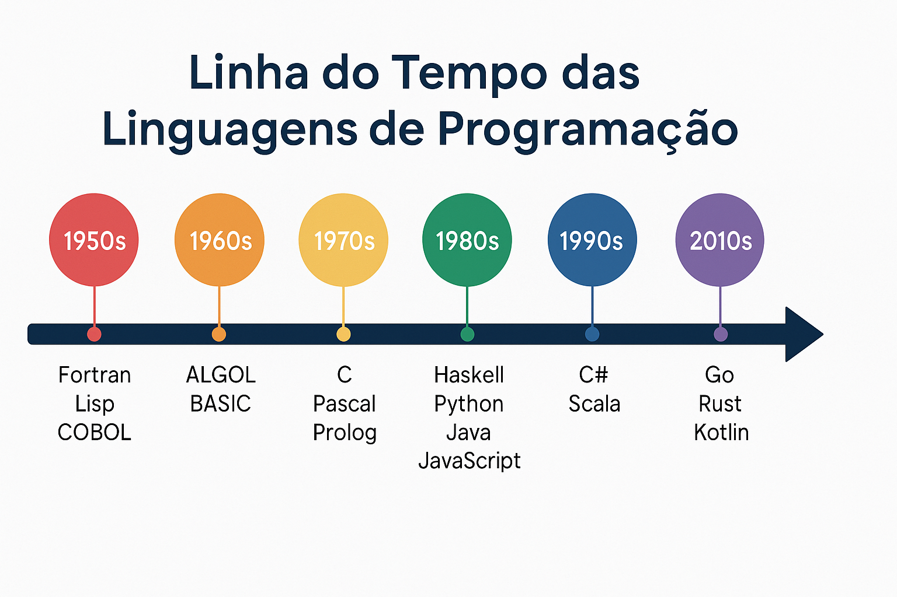

# Introdução às Linguagens de Programação

Linha do tempo das linguagens:
- 1957 - Fortran
- 1970 - Pascal
- 1972 - C
- 1983 - C++
- 1991 - Python
- 1995 - Java, JavaScript
- 2009 - Go
- 2010 - Rust

